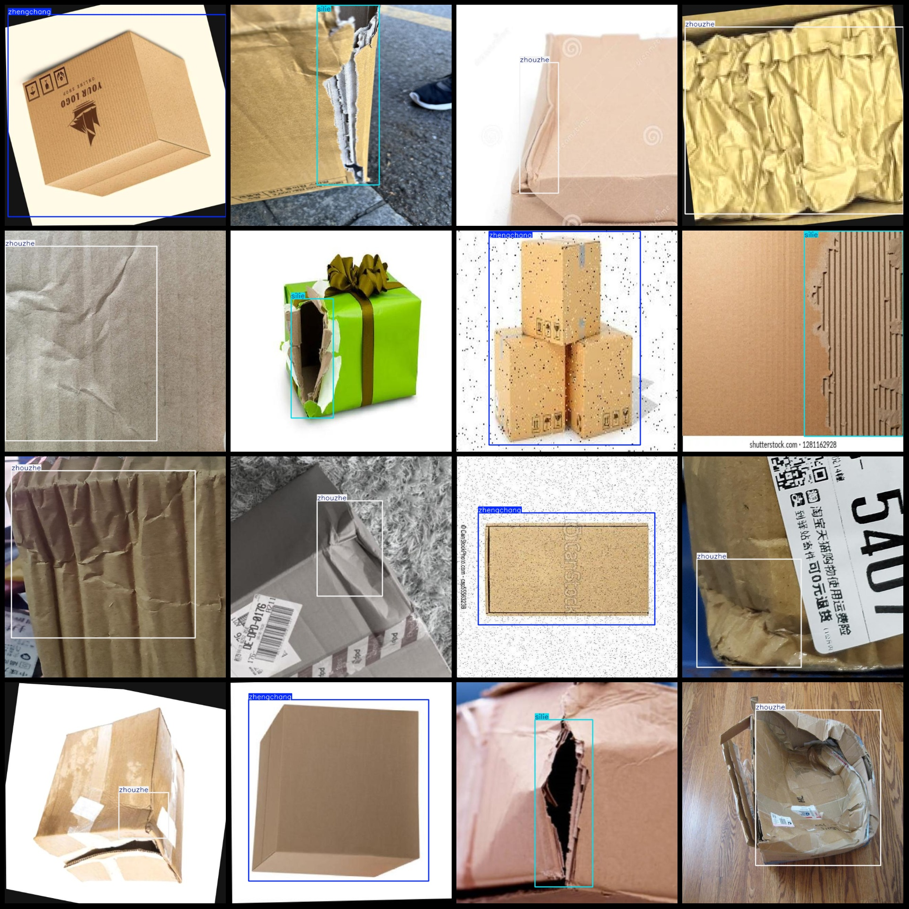
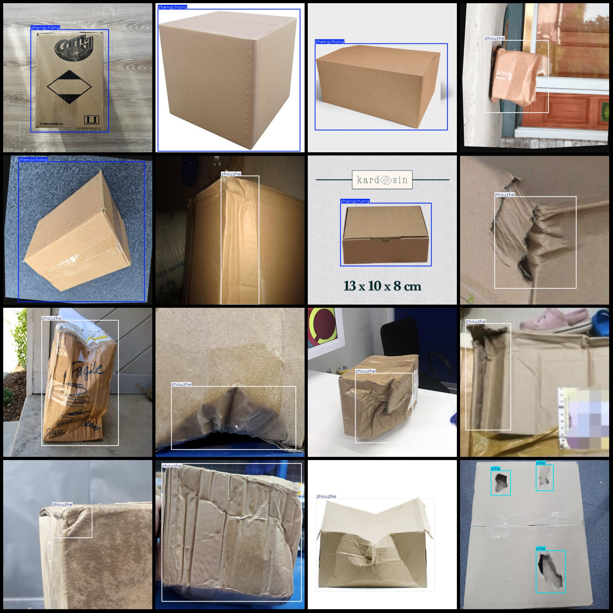

# Data Set: Damaged and Tear-Scarred Detection of Express Delivery Boxes in VOC+YOLO format with 1626 images across 3 categories enhanced

**Note:** The dataset contains images with enhancements, mainly rotation and noise.

Dataset format: Pascal VOC format + YOLO format (without split path in txtfile, only include jpgimage and corresponding VOC format xmlfile and yolo format txtfile)

The number of jpg files is 1626.

**Number of XML files:** 1626

**annotation count: **1626

Annotation class number: 3

[Tear, Normal, Fold]

**Each category has a specified number of boxes:**

- **Tearing** box count = 577
- **Normal** box count = 439
- **Folds** box count = 786

**total boxes: **1802

**Each category occupies a certain number of pictures:**

The number of images torn = 412
- **Normal** images = 439
- **Folds** images = 775

The resolution of the image is 640x640.

Use annotation tool: labelImg

Annotation rule: Draw a rectangle around the class.

**Important Notes:** The dataset does not have separate training, validation, and test sets. You need to create them yourself.

**Special Disclaimer:** This dataset does not guarantee the accuracy of the trained model or the weight files.

## Images

Here is a pay link on Stripe ( https://buy.stripe.com/3cs8yP7sY87d0vu9AB ). Please contact me lonlonago@foxmail.com after funding $89, and I will send you a complete data files , thank you!

